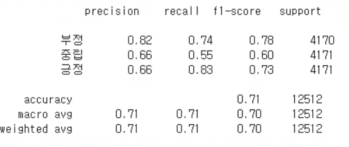
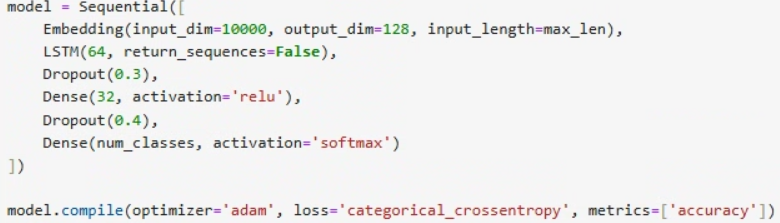
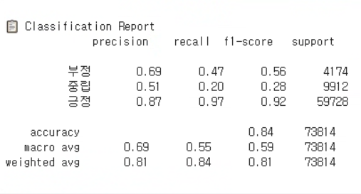

# 📊 성남시 음식점 리뷰 감성 분석 시스템

[](https://share.streamlit.io/your-deployment-link)

> 네이버 지도에서 수집한 음식점 리뷰를 기반으로 감성 분석을 수행하고 시각적으로 분석 결과를 보여주는 Streamlit 기반 웹 애플리케이션입니다.

---

## 🧠 주요 기능

- ✅ **리뷰 기반 감성 분석** (긍정 / 중립 / 부정)
- ✅ **감정 비율 파이차트 시각화**
- ✅ **GPT-4 기반 장점/개선점 요약**
- ✅ **감정별 워드클라우드 생성**
- ✅ **개별 리뷰 실시간 감성 분석**
- ✅ **자동완성 검색 UI (음식점명 입력 시 유사 항목 제시)**

---

## 🗂️ 폴더 구조

```
.
├── App.py                        # Streamlit 메인 앱
├── ModelLoader.py               # 모델 및 토크나이저 로더
├── SentimentPredictor.py        # 리뷰 감성 예측 모듈
├── ReviewSummary.py             # GPT-4o 요약 함수
├── TextProcessor.py             # 키워드 추출 및 형태소 분석기
├── Visualization.py             # 파이 차트, 텍스트 시각화
├── WordCloudVisualizer.py       # 워드클라우드 생성기
├── requirements.txt             # 패키지 목록
├── packages.txt                 # Streamlit Cloud용 Linux 패키지
├── restaurant_reviews.csv       # 네이버 음식점 리뷰 데이터셋
├── malgun.ttf                   # 워드클라우드 한글 폰트
├── .gitignore
├── .gitattributes
├── README.md
└── images/
    ├── kc electra 리포트.png
    ├── kc electra 주요코드.png
    ├── lstm 리포트.png
    └── lstm 주요 코드.png
```

---

## 🧠 감성 분석 모델 비교

| 모델명       | 아키텍처                    | 주요 특징 |
|--------------|-----------------------------|------------|
| 🔵 **LSTM**  | RNN 기반 (시퀀스 처리)       | - Okt 형태소 분석기 사용<br>- 임베딩 → BiLSTM → Dense<br>- 시계열 데이터 처리에 강점 |
| 🟣 **KcELECTRA** | Transformer 기반 (Pre-trained) | - `beomi/KcELECTRA-base` 기반<br>- 한국어 뉴스/위키 기반 사전학습<br>- 문맥 이해 및 분류에 강점 |

> 현재 앱에서는 **KcELECTRA 기반 모델**을 기본으로 사용합니다.

---

### 📌 코드/리포트 비교

#### 🔷 KcELECTRA

- 주요 코드  
  

- 리포트  
  

#### 🔷 LSTM

- 주요 코드  
  

- 리포트  
  
---

## 🌐 실행 방법

### ✅ 1. 로컬 실행

```bash
pip install -r requirements.txt
streamlit run App.py
```

### ✅ 2. Streamlit Cloud 배포

`packages.txt`에 다음 내용 포함:

```
default-jre
```

`.streamlit/secrets.toml`에는 OpenAI API 키를 포함:

```toml
[openai]
api_key = "sk-xxx..."
```

---

## 📦 배포 환경 (Streamlit Cloud)

Konlpy 사용을 위해 `packages.txt`에 Java 런타임을 포함해야 합니다.

### packages.txt

```
default-jre
```

그리고 `.streamlit/secrets.toml`에는 OpenAI API 키를 포함시켜야 합니다.

### secrets.toml

```
OPENAI_API_KEY = "sk-..."
```

---

## 🧹 사용 기술

| 분야       | 기술 스택 |
|------------|-------------------------------|
| 웹 UI      | Streamlit, Matplotlib, WordCloud |
| 자연어처리 | KoNLPy (Okt), Transformers (KcELECTRA), TensorFlow (LSTM) |
| 크롤링     | Selenium, BeautifulSoup |
| 모델 배포  | Git LFS (또는 별도 모델 다운로드 경로 제공) |
| 요약       | OpenAI GPT API 활용 요약 기능 |

---

## 📈 결과 예시

- 감정 비율 파이차트
- 긍정/부정 리뷰 요약
- 감정별 워드클라우드

---

## 📚 참고 자료

- HuggingFace KcELECTRA 모델: https://huggingface.co/beomi/KcELECTRA-base
- OpenAI GPT-4 API: https://platform.openai.com/
- Streamlit 배포 가이드: https://docs.streamlit.io/

---

## 🙋‍♀️ 만든 사람

- 박세연  
- 한국폴리텍 성남캠퍼스 인공지능소프트웨어과 2학년  
- Backend & NLP Engineer  
- GitHub: [tpdus751](https://github.com/tpdus751)
