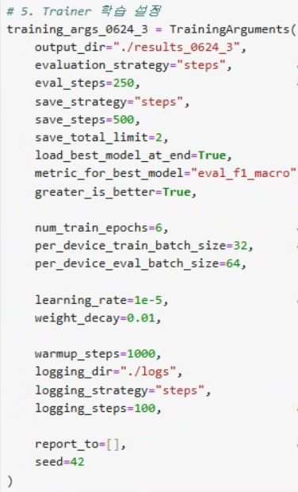

# 📊 성남시 음식점 리뷰 감성 분석 앱

성남시 음식점의 네이버 리뷰를 기반으로, **KcELECTRA 감성 분석 모델**을 활용하여 리뷰를 긍정/중립/부정으로 분류하고, GPT-4o를 통해 **리뷰 요약**까지 제공하는 웹 애플리케이션입니다.

<p align="center">
  
</p>

---

## 📁 프로젝트 구조

```bash
seongnam-restaurant-sentiment-analysis/
├── kc_electra_model.zip              # 모델 압축본 (배포 시 GDrive에서 자동 다운로드)
├── .streamlit/
│   ├── config.toml                   # Streamlit 설정
│   └── secrets.toml                  # API 키 보관용
├── images/                           # 모델 비교용 이미지들
│   ├── lstm 주요코드.png
│   ├── lstm 리포트.png
│   ├── kc electra 주요코드.png
│   └── kc electra 리포트.png
├── App.py                            # Streamlit 메인 앱
├── ModelLoader.py                    # 모델 로드 함수
├── SentimentPredictor.py            # 감성 분석 함수
├── ReviewSummary.py                 # GPT 요약 함수
├── TextProcessor.py                 # 키워드 추출
├── Visualization.py                 # 파이차트, 워드클라우드 시각화
├── WordCloudVisualizer.py           # 워드클라우드 그리기
├── requirements.txt                 # 필요 패키지
├── packages.txt                     # Java 설치용 (konlpy)
├── restaurant_reviews.csv           # 수집된 리뷰 데이터셋
├── malgun.ttf                       # 워드클라우드 한글 폰트
└── README.md
🚀 실행 방법
1. 로컬에서 실행
bash
복사
편집
# 설치
pip install -r requirements.txt

# 실행
streamlit run App.py
2. Streamlit Community Cloud 배포 시 설정
packages.txt 에 default-jre 포함 (konlpy용 Java 설치)

.streamlit/secrets.toml에 OpenAI API 키 설정

toml
복사
편집
[openai]
api_key = "sk-xxxxxxxxxxxxxxxxxxx"
🧠 감성 분석 모델 비교
모델	설명
LSTM	Okt 형태소 분석 후 시퀀스를 입력으로 받아 학습 (Keras 기반)
KcELECTRA	HuggingFace beomi/KcELECTRA-base 기반, 한국어에 특화된 Transformer

현재 앱은 성능이 우수한 KcELECTRA 모델을 사용 중입니다.

🔬 주요 코드 비교 및 성능 리포트
LSTM 주요 코드	LSTM 성능 리포트
	

KcELECTRA 주요 코드	KcELECTRA 성능 리포트
	

✨ 기능 요약
🔍 음식점 이름 자동완성 검색

📊 리뷰 감성 분석 (긍정 / 중립 / 부정)

🧠 GPT-4o 기반 장점/개선점 요약

🖼️ 감정별 워드클라우드 생성

📝 사용자 입력 리뷰에 대한 감성 예측

📌 모델 다운로드 자동화
앱 최초 실행 시, 모델이 없으면 Google Drive에서 kc_electra_model.zip 자동 다운로드 후 압축 해제합니다.

📚 기술 스택
Python / Streamlit / Pandas / Matplotlib / WordCloud

HuggingFace Transformers (beomi/KcELECTRA-base)

Tensorflow (LSTM)

OpenAI GPT API (요약)

KoNLPy + Okt (형태소 분석)

🙋🏻‍♂️ 만든 사람
👤 박세연 – 한국폴리텍 성남캠퍼스 인공지능소프트웨어과

📫 GitHub

